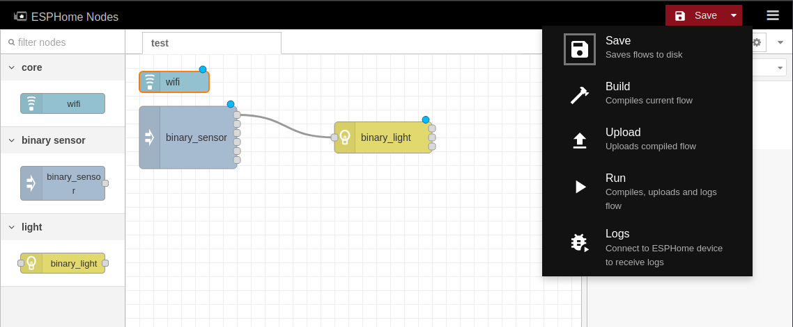

# ESPHome Nodes

Under development ESPHome config builder.

Uses Node-RED editor with a python runtime (though more apt to simply call it a python API replacement, and currently no runtime (will be ESPHome))



Currently very early in development, only looks at flow in first tab.

Contains a few hand-built nodes with minimal subsets of their complete configurations.

### TODO (required for base level of functionality):
- [x] Add ability to have multiple inputs on nodes
- [x] Integrate slightly into ESPHome
- [ ] Start programatically generating nodes using ESPHome component schemas
- [ ] Improve flow -> yaml parser
- [ ] Node-RED plugin for ESPHome serial device picker
- [ ] Actually run the build, upload, run commands

### Future Ideas/TODO:
- Each base platform with filters should have a filter node
- Add and/or/not and while to if condition
- Lambdas
- Add cpp syntax highlighting to Monaco editor
- Introduce editor with quick tour
- util node to order if then actions
- Option on nodes to toggle visiiblity of individual node inputs/outputs
- Secrets in flow env?
- Validate nodes using ESPHome VSCode validator?
- Bring logger component nodes into Node-RED debug system
- Trigger inputs, just like possible using ESPHome on device
- Attempt to merge deployment custom dropdown options/actions back into Node-RED mainline (so we don't have to continue monkey patching it)
- Bring ESPHome Docs into nodes documentation
- Visual ESP board pin picker widget for common boards
- Optional always on labels for node ports
- Support building nodes from external git repos - reuse palette manager


## Development

Check out this repository, `cd nodes`, run `npm install` and then run

```sh
python3 server.py /dir/of/yaml/and/flows/
```

Editor should be at `localhost:8888/nodes/`